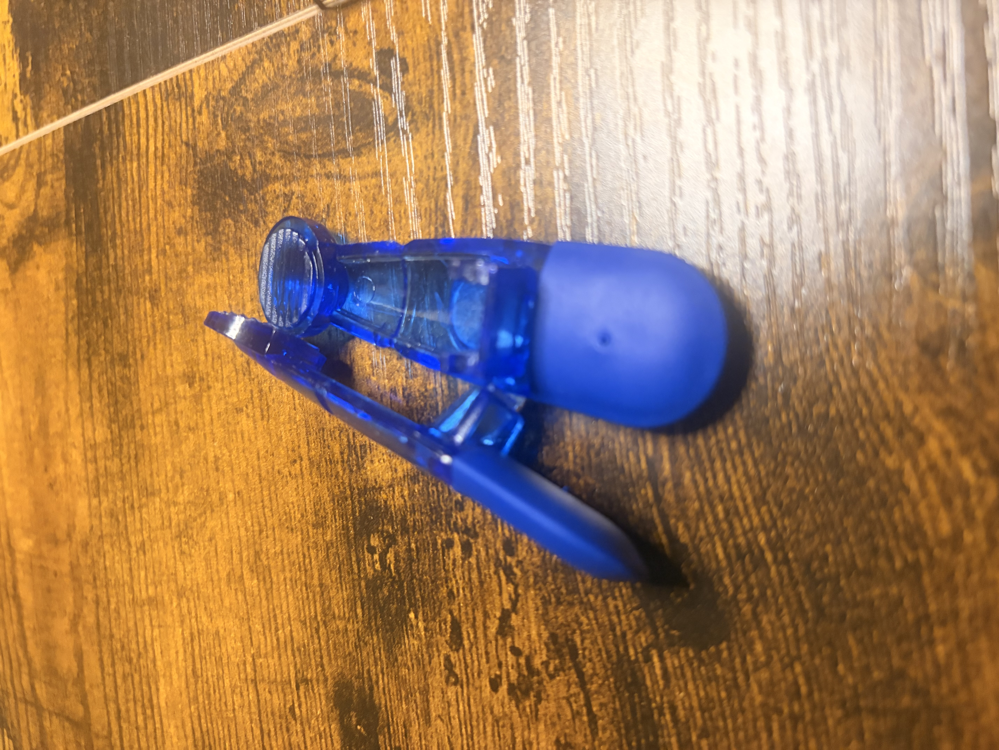
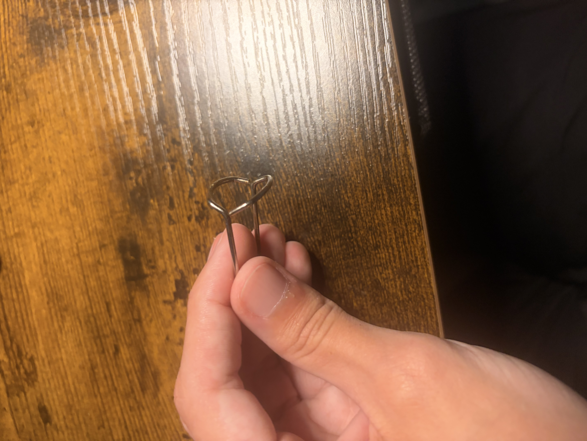

# A1 – Build your Professional Portfolio

## Objective
Use the analyze, decide and communicate pillars, in order to develop a portfolio with proper orientation and documentation.

## Analyze
### Task A - Portfolio Analysis
For this task I evaluated two portfolio's by four main points; navigability, reproducibility, evidence of reasoning and professional tone.

**Portfolio 1: For the first portfolio I found a Nathan Hoong's engineering portfolio on git hub. (Hoong, N. (n.d.). Engineering portfolio: Nathan Hoong. Nathan Hoong’s Engineering Portfolio. https://nhoong.github.io/)**

Navigability: This portfolio was very well structured and listed Nathan's big projects in order and explained each one in detail. All it took to find the descriptions, engineering drawings, and cad models was to scroll down and find the desired projects.

Reproducibility: Each project is well documented and any engineer could immediately work on recreating Nathan's work. All of the projects are introduced with a general description and summary of what the project was, as well as a objective and result of the project. Its then accompanied by a isometric view of the complete design, engineering drawings with dimensions of each component, and an exploded view of the completed design.

Evidence of reasoning: The portfolio was a little lacking in this section. His senior capstone was very well detailed and gave reasons for the choices made during the prototyping process. However, most of the other designs are just showing the finished product and what it does without actually giving reasoning for the design choices.

Professional tone: I think this portfolio had good professional tone. All of the descriptions were detailed as to exactly what function the designs were preforming and the whole document was up to a standard in which I would show an employer.

### Task B - Product Analysis
**For this task I chose a spring clamp as my product.**

The Primary function of the spring clamp is to apply and maintain a clamping force between two jaws, in order to secure an object like holding a bag shut or clamping clothes to a clothesline. A force applied by the users fingers is converted into a rotational motion by the spring to open the jaws. Once the clip is over the desired object the force is released, the springs elastic force closes the jaws and they clamp down pinning the desired object. 

The governing model of the primary function of this spring clamp is the torsional spring relationship. This is seen as: &tau;=k*&theta;:

Where &tau; is the torque produced by the spring, k is the torsional spring constant, and &theta; is the angular displacement of the spring from its unloaded position. This model shows that the spring produces a torque that drives the two jaws toward each other. **Assumption to be made**

**Component 1 and 2: Both Jaws**

The first two components are two plastic jaws the mirror each other and hold the same functions. The geometry of these pieces is elongated, which provides a lever arm between the spring or pivot region. This geometry allows for less force and movement from the users fingers in order to produce movement at the jaws. The wide curve at the edge of the jaws and grooves on the face allows for more surface connection when the pin clamps down on an object. The groove on the side of the piece lets the spring sit on the jaw without moving around. The two jaws are connected via a ball and socket connection, which allows for smooth opening and closing at the pivot point.

**Component 3: Spring/Wire** 

The wire is shaped in a way that functions the same as a torsional spring. The wire extends over the top of the two jaws in order to hold them together at a fixed clamping position. When the handles are squeezed the jaws force the wire to rotate away from its relaxed position. This allows for the wire to store up elastic energy, which is then released as torque once the handle stops being squeezed and forces the jaws to clamp back to the relaxed position. The position of the wire and where that pivot point is important as it determines the mechanical advantage and how much clamping force is produced at the jaws surface.

The patent that holds the same principals as my product is _U.S. Patent No. 2,748,437_, invented by Louis R. Dold. The patent was issued on June 5, 1956. 

Two alternative solutions would be a wire clothespin and a binder clip. The wire clothes pin serves the same function that the spring clamp does, except is utilizes one singular piece of wire shaped into one cohesive pin. a binder clip serves the same function but it utilizes a solid piece of metal in-between two metal handles to clamp objects.

One specific design decision I would highlight is the elongated geometry of the two jaws to provide a lever arm. This decision was most likely made because lever action provides mechanical advantage. This allows for a relatively small amount of force being needed to pry the jaws apart, but still gives a good amount of torque from the spring in order to hold the jaws shut. This also allows for the product to be used one handed. 
## Decide

## Communicate

