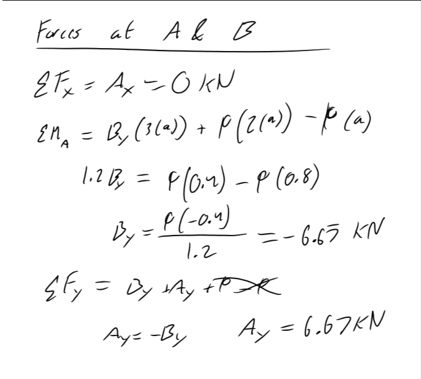
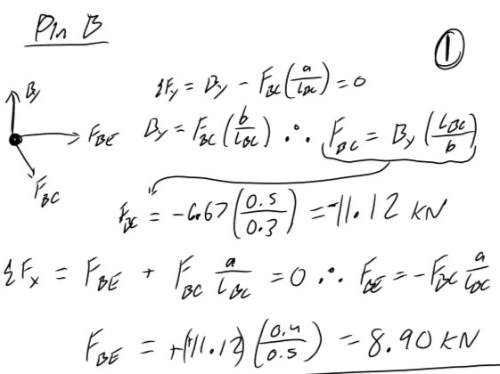
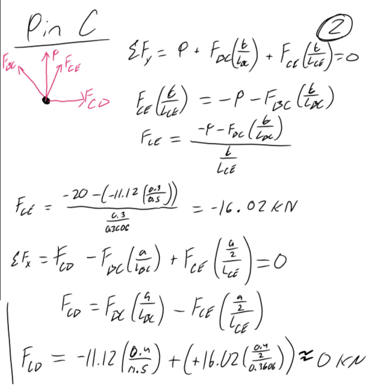
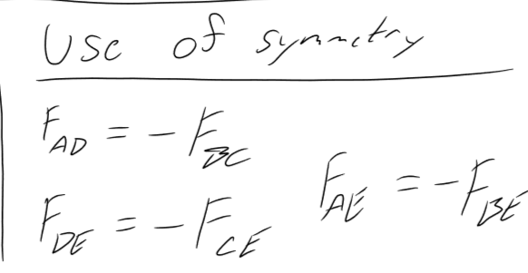
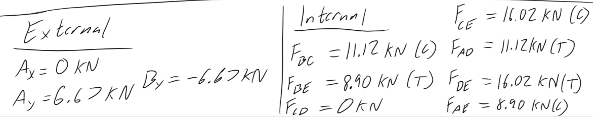

# A2 – Truss Stress Analysis

## Objective
For this assignment I had the task to design a truss system. The system had a set of requirements given by the professor and I was given a starting point with Figure 1.

(Figure 1)

The requirements are as follows: 
1. Force P must be between 20kN and 30kN
2. a=0.4m
3. b=0.3m
4. The pins are to be identical to each other and the elements have to have the same cross-sectional geometry.
5. Point A is a Pin
6. Point B is a Roller
7. The truss system is to be lightweight and made of A500 steel.

## Analyze
Given all of  this information my first instinct was to sit down and brainstorm different solutions that could be made. I took in all my parameters and started writing down all the combinations of truss elements that were possible within the orientation given in Figure 1. This was the hardest part to of the assignment because I wanted to balance efficiency and structural integrity, all while using as little amount of pins and elements as possible to minimize the overall weight of the truss. I also set my P value in stone at 20kN for simplicity given math with nicely rounded forces is often times better.

## Decide

(Figure 2)

After deliberating and taking into account my parameters I decided on the structure in figure 2. There are a couple reasons as to why I chose to place joint E between A and B, and connect A, B, C, and D to joint E. Starting with my placement of joint E, I chose this spot because it enabled the truss to have symmetry about an axis straight down the middle. I knew from my experience with trusses, that this would allow me to make the most of my time  when calculating the internal forces in each element and when calculating the lengths of each member. I made connections between all of the joints to E because it gave the truss stability To not only handle the load I was given, but also other loads that could potentially effect my design in time. 

Before moving on to finding forces I needed to do a handful of things. The first was to develop a Free Body Diagram that would help me out later down the line, which is seen in figure 2. In this step I also went ahead and found the lengths of each member so I could use those in the math that was to come. 

## Communicate

Now after outlining all of my knowns, deciding on a structure, and determining some unknowns like force P and the lengths of the members, it was time for me to start solving for the forces present. 

Throughout the entire design process I utilized the formulas for equilibrium, which are the sum of forces equal zero in all directions and sum of moments equal zero. 

(Figure 3)

As seen in figure 3 I start by outlining my equation with variables, which I can then plug values into to solve for my desired force. This is where i determined that Ax=0kN, Ay=6.67kN, and By=-6.67kN. I then used these values to solve for the internal force reactions using method of joints. Method of joints is where I start at one joint and analyze it fully, and then move on to the next one. When starting on this method I looked through the joints and figured out which joint would have the least amount of unknown variables. I did this so I could fully analyze the first joint and cause a sort of "chain reaction to solve the rest of the joints.

The joint I decided to start on was B because it only had two unknowns that I could put into two different Fx and Fy equations.

(Figure 4)

As seen in Figure 4, after I wrote out both equations I knew I had to start with sum of Fy in order to determine the force along element BC. Once I found that I was able to use it to find the force along element BE. At this pin I found that Force BC=-11.12kN and Force BE=8.90kN. 

After joint B I continued down the line to Joint C.

(Figure 5)

Here I used the force at BC and the equilibrium equations to help find the forces at CD and CE. I specifically had analyze the forces in the y direction first to determine CE. Otherwise I would have been left with two unknown forces at once as seen in Figure 5 with the sum of forces in the x direction. The force at CD ended up being so small that it was practically 0kN; however, that did not mean I could remove that element because it would still assist my truss if it were to have a different load type.

After finding the reactions at these two joints I used my reasoning of symmetry that I considered at the start of this assignment. The load(P) on the right side of the truss was acting with the same magnitude as the load(P) on the left but in the opposite direction. This led me to make the logical conclusion that all of the member reactions would be acting with the same magnitudes as their counterparts, but with different directions. That is how I came up with the idea in figure 6.

(Figure 6)

All of the external pin reactions and the internal member reactions are are summed up below in figure 7.

