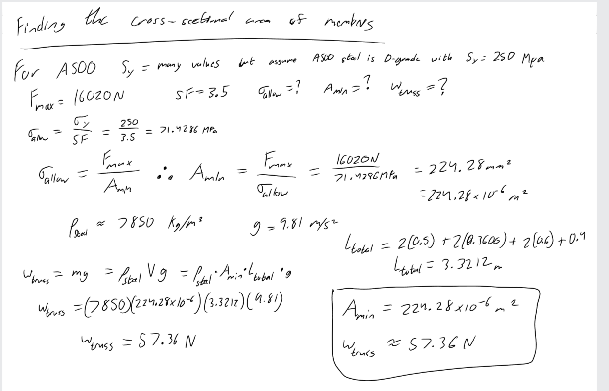
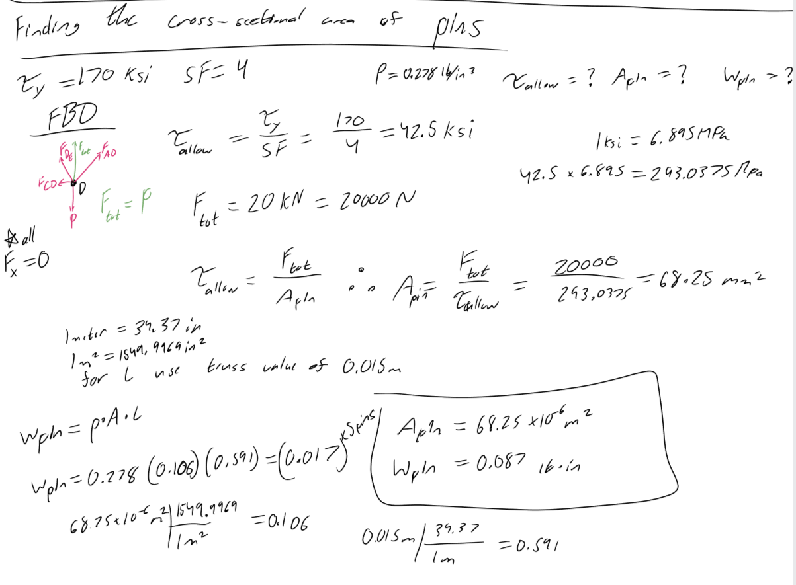
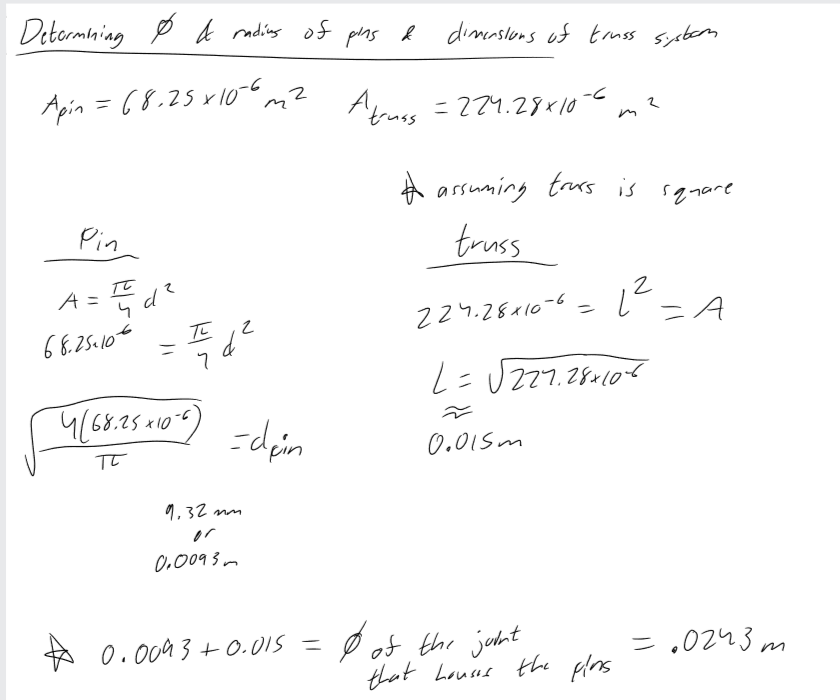
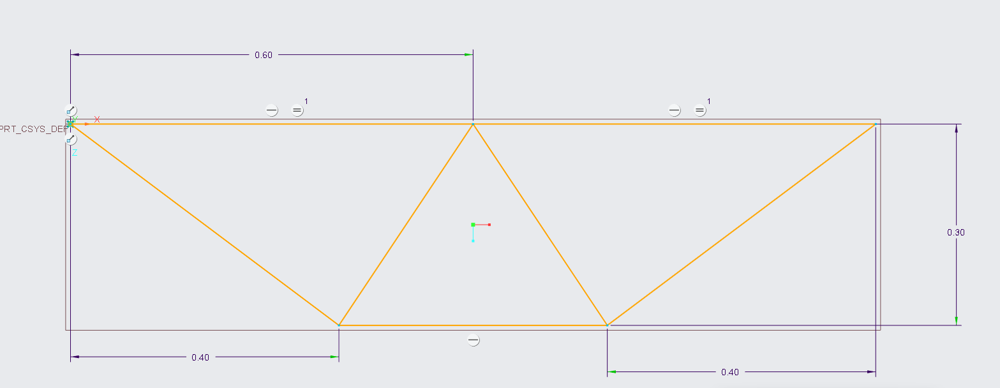
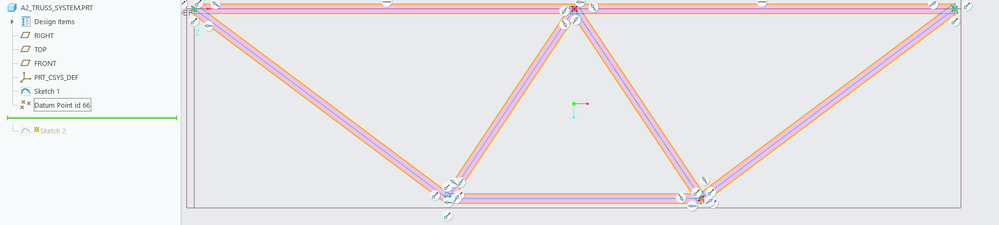
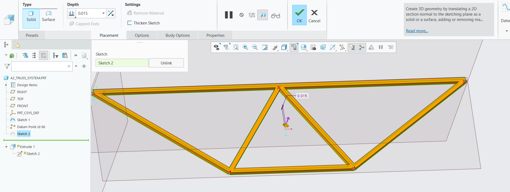
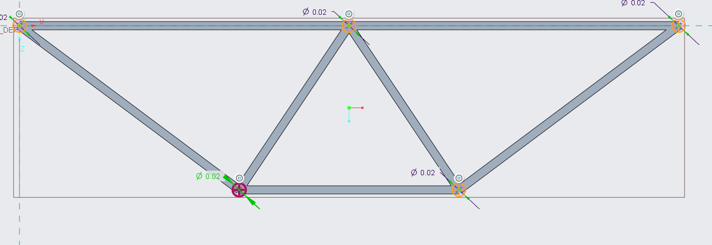
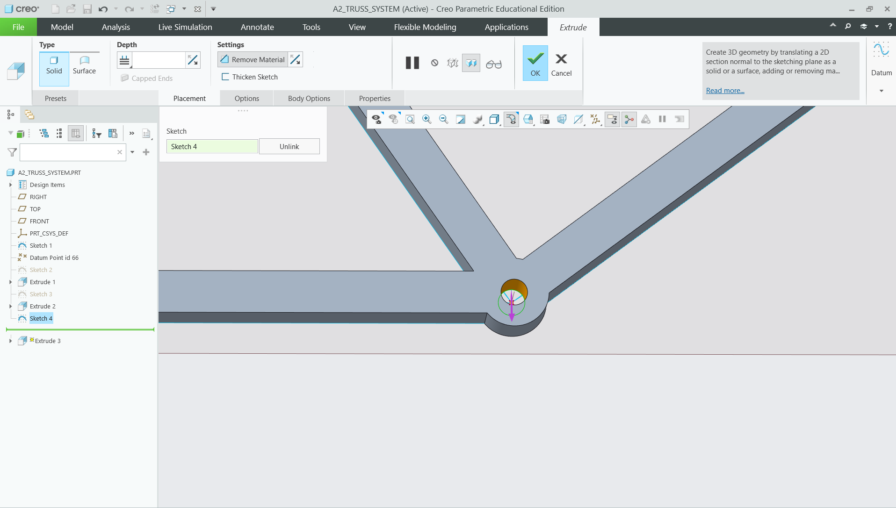
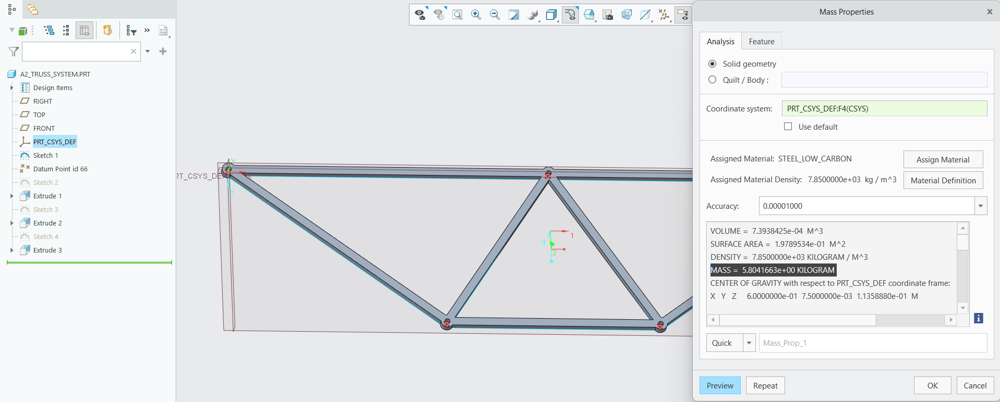

# A2 – Truss Stress Analysis

## Objective
For this assignment I had the task to design a truss system. The system had a set of requirements given by the professor and I was given a starting point with Figure 1.

(Figure 1)

The requirements are as follows: 
1. Force P must be between 20kN and 30kN
2. a=0.4m
3. b=0.3m
4. The pins are to be identical to each other and the elements have to have the same cross-sectional geometry.
5. Point A is a Pin
6. Point B is a Roller
7. The truss system is to be lightweight and made of A500 steel.

## Analyze
Given all of  this information my first instinct was to sit down and brainstorm different solutions that could be made. I took in all my parameters and started writing down all the combinations of truss elements that were possible within the orientation given in Figure 1. This was the hardest part to of the assignment because I wanted to balance efficiency and structural integrity, all while using as little amount of pins and elements as possible to minimize the overall weight of the truss. I also set my P value in stone at 20kN for simplicity given math with nicely rounded forces is often times better.

## Decide

(Figure 2)

After deliberating and taking into account my parameters I decided on the structure in figure 2. There are a couple reasons as to why I chose to place joint E between A and B, and connect A, B, C, and D to joint E. Starting with my placement of joint E, I chose this spot because it enabled the truss to have symmetry about an axis straight down the middle. I knew from my experience with trusses, that this would allow me to make the most of my time  when calculating the internal forces in each element and when calculating the lengths of each member. I made connections between all of the joints to E because it gave the truss stability To not only handle the load I was given, but also other loads that could potentially effect my design in time. 

Before moving on to finding forces I needed to do a handful of things. The first was to develop a Free Body Diagram that would help me out later down the line, which is seen in figure 2. In this step I also went ahead and found the lengths of each member so I could use those in the math that was to come. 

## Communicate

Now after outlining all of my knowns, deciding on a structure, and determining some unknowns like force P and the lengths of the members, it was time for me to start solving for the forces present. 

Throughout the entire design process I utilized the formulas for equilibrium, which are the sum of forces equal zero in all directions and sum of moments equal zero. 

### External Forces

(Figure 3)

As seen in figure 3 I start by outlining my equation with variables, which I can then plug values into to solve for my desired force. This is where i determined that Ax=0kN, Ay=6.67kN, and By=-6.67kN. I then used these values to solve for the internal force reactions using method of joints. Method of joints is where I start at one joint and analyze it fully, and then move on to the next one. When starting on this method I looked through the joints and figured out which joint would have the least amount of unknown variables. I did this so I could fully analyze the first joint and cause a sort of "chain reaction to solve the rest of the joints.

### Internal Forces
The joint I decided to start on was B because it only had two unknowns that I could put into two different Fx and Fy equations.

(Figure 4)

As seen in Figure 4, after I wrote out both equations I knew I had to start with sum of Fy in order to determine the force along element BC. Once I found that I was able to use it to find the force along element BE. At this pin I found that Force BC=-11.12kN and Force BE=8.90kN. 

After joint B I continued down the line to Joint C.

(Figure 5)

Here I used the force at BC and the equilibrium equations to help find the forces at CD and CE. I specifically had analyze the forces in the y direction first to determine CE. Otherwise I would have been left with two unknown forces at once as seen in Figure 5 with the sum of forces in the x direction. The force at CD ended up being so small that it was practically 0kN; however, that did not mean I could remove that element because it would still assist my truss if it were to have a different load type. At this joint I found that Force CE=-16.02kN and Force CD=0kN.

After finding the reactions at these two joints I used my reasoning of symmetry that I considered at the start of this assignment. The load(P) on the right side of the truss was acting with the same magnitude as the load(P) on the left but in the opposite direction. This led me to make the logical conclusion that all of the member reactions would be acting with the same magnitudes as their counterparts, but with different directions. That is how I came up with the idea in figure 6.

(Figure 6)

All of the external pin reactions and the internal member reactions are are summed up below in figure 7.

(Figure 7)

### Cross-Sectional Area of Members
My next task was to find the cross-sectional area of my members and the overall weight of the trusses. 

I was given that the material was A500 steel and the safety Factor was 3.5. The first thing I did was determine what formulas and principals I would need to use in order to find these things. I knew that I needed my maximum allowed stress in order to find the minimum area of the trusses, which is represented by the formula Stress(max)=Force(max)/Area(min). I then found that I could use yield strength and the safety factor in order to find the maximum allowed stress. Then for weight I needed the density of my trusses, the volume, the total length, and the cross-sectional area of the trusses. My maximum force was determined by the largest internal force found at 16.02kN.

In order to even start my process I searched for the density and the yield strength of A500 steel. I used these values to begin calculating for max allowed stress, minimum cross-sectional area, and the total weight of the truss system as seen in figure 8. I made my trusses a square shape in order to simplify the 3D modeling process later on.

(Figure 8)

### Cross-Sectional Area of pins
After finding the cross-sectional area and weight of my members, I moved on to finding the same for my pins. 

For this part I was already given the yield shear strength of the pin material and the density of the material. To make the values of my areas consistent I converted the yield shear strength from Kips to MPa, which I did to keep all my dimensional values in meters. Knowing that I was finding the same things I did for the elements, I applied the same equations as seen in figure 9.

(Figure 9)

### 3D-Model of the truss

Before I ever opened Creo to 3D-model my truss, I knew I would need values like length of trusses and diameter of the pins. To do this I made a choice to make my trusses square so I could set the minimum cross-sectional area equal to L*L. I used the standard formula for a circle to determine the diameter of each pin. I also added the width of the trusses to the pins diameter, which I did to make a proper housing for the pins that would also connect with each truss. It is important for me to note that I initially tried to make the trusses round rods; however, I shortly realized that was far too difficult and decided to instead chose a square shape. All of my math to determine the Width, Diameter and pin housing diameter can be found in Figure 10.

(Figure 10)

It was only after all of this that I began 3D-Modeling my truss.

(Figure 11)

I started by first setting up a line sketch in order to get the proper length dimensions of each truss element. I then placed reference points at each joint in order to use later.

(Figure 12)

Using these reference points and the original sketch line as a tangent constraint, I places slanted rectangles and adjusted them to match the length that I found in Figure 10.

(Figure 13)

Since I assumed the truss elements were square I then extruded the truss elements up the same length that I found in Figure 10.

(Figure 14)

After finishing the truss elements I moved on to the Joints. I made my joints by using the reference points I placed earlier to make center-line circles at each one. The diameter for this was the pin diameter added to the truss width as found in Figure 10.

(Figure 15)

My final step was to cut out holes for the pins in the joints. I again used the reference points to make holes with the exact pin diameter I found in Figure 10.

(Figure 16)

After fully finishing the design I made the material for the truss A500 steel and multiplied the assumed mass of the truss by 9.81. This gave me the predicted weight of 51.72N. This tells me that my calculated weight is far higher than the simulated weight by about 5N-6N.

### Lesson Learned
This Project taught me that I have to thoroughly think out my choices before making them, and also that getting a project complete takes a lot more planning than I had ever thought. The planning alone took me hours longer than the actual modeling on CREO. I also would have saved myself so much time had I better thought out things like just making the truss elements square versus round.

### Likelihood of Failure Modes in Truss Components
The goal of this section is to understand and research the different failure modes for the truss components.
#### Truss members
While researching I found that there is a main difference between buckling and yielding. That difference is whether the material is in tension or compression. If the object is in high tension then you will get yielding, which can be described as the object permanently deforming. If the object is in high compression then you will get buckling, which can be described as fast changing of the objects structure. This often seen with long and thin structures. Fracturing can happen in both cases of yielding and buckling; however, it is more determined by how ductile the material is. In my case the material A500 is seen as a more ductile material.

Given that the material of my truss is more ductile, I would imagine that the truss would fail due to yielding and buckling before it ever had the chance to fracture. The truss is designed with a very specific load in thought. This leads me to believe that if the load were to change then it would cause elements to exceed the maximum allowed stress causing that deformation. As shown in Figure 7, my elements that are in tension are more likely to to yield and my elements that are in compression are more likely to buckle. Something I would add to address the buckling of the truss would be to add bracing to the middle of the rods in compression. This would add more stability to the weaker points that are more prone to buckle.
#### Pin Connections
At the current load type I would say it is unlikely that the pins would have any shear failure at all. To determine this I used the maximum force acting on a pin at 16.02kN. When you convert this value to Kips and divide the force by the cross-sectional area of the pin you get 34.05ksi. The pins are designed to withhold a maximum of 42.5ksi. This giant disparage in values leads me to believe that the pins would never actually fail. What is more likely is that the truss section about the pins are going to deform over time. If the load were changed greatly, then I could see the pins fracturing due to the shear stress.
#### Sources
https://www.surescreenmaterials.com/failure-mechanisms/buckling-and-yielding
