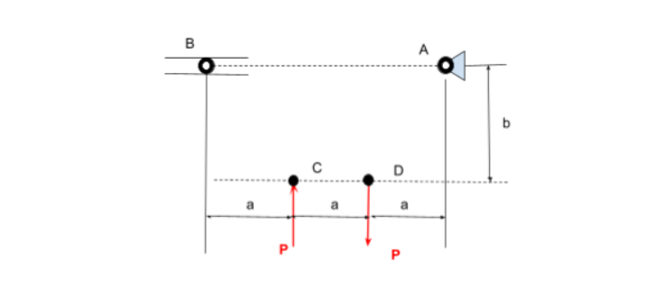
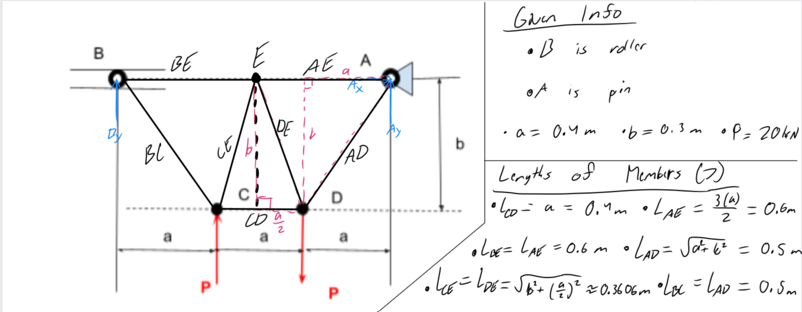

# A2 – Truss Stress Analysis

## Objective
For this assignment I had the task to design a truss system. The system had a set of requirements given by the professor and I was given a starting point with Figure 1.

(Figure 1)

The requirements are as follows: 
1. Force P must be between 20kN and 30kN
2. a=0.4m
3. b=0.3m
4. The pins are to be identical to each other and the elements have to have the same cross-sectional geometry.
5. Point A is a Pin
6. Point B is a Roller
7. The truss system is to be lightweight and made of A500 steel.

## Analyze
Given all of  this information my first instinct was to sit down and brainstorm different solutions that could be made. I took in all my parameters and started writing down all the combinations of truss elements that were possible within the orientation given in Figure 1. This was the hardest part to of the assignment because I wanted to balance efficiency and structural integrity, all while using as little amount of pins and elements as possible to minimize the overall weight of the truss. I also set my P value in stone at 20kN for simplicity given math with nicely rounded forces is often times better.

## Decide

(Figure 2)

After deliberating and taking into account my parameters I decided on the structure in figure 2. There are a couple reasons as to why I chose to place joint E between A and B, and connect A, B, C, and D to joint E. Starting with my placement of joint E, I chose this spot because it enabled the truss to have symmetry about an axis straight down the middle. I knew from my experience with trusses, that this would allow me to make the most of my time  when calculating the internal forces in each element and when calculating the lengths of each member. I made connections between all of the joints to E because it gave the truss stability To not only handle the load I was given, but also other loads that could potentially effect my design in time. In this step I also went ahead and found the lengths of each member so I could use those in the math that was to come.

## Communicate

