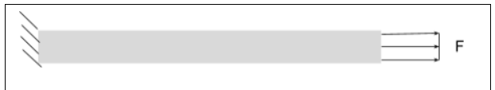

# A3 – Parametric and FEA

## Objective
The goal for this assignment was to use parametric design to deign an aluminum bar by assigning dimensions to their appropriate parameters. We also needed to use Finite Element Analysis to examine trends like maximum stress within the bar.

## Analyze
The first thing I did for this assignment was I took time to read and note all of the values I would need. I utilized the elongation equation, so I needed to determined what I knew and what I needed to know. The maximum elongation was given to me at 0.009 inches. I was given rages for force between 300-500 lbf, and I was given a range for Young's Modulus between (8.5-11.5)E6 psi. Per the assignment I was free to decide the value of the cross sectional area and the force within the given range. Young's Modulus was determined by the material which had to be aluminum. 

(Figure 1)

As seen in figure 1 the geometry is a simple bar, fixed on one side, with a force pulling the bar axially.

## Decide
After taking 

## Communicate

