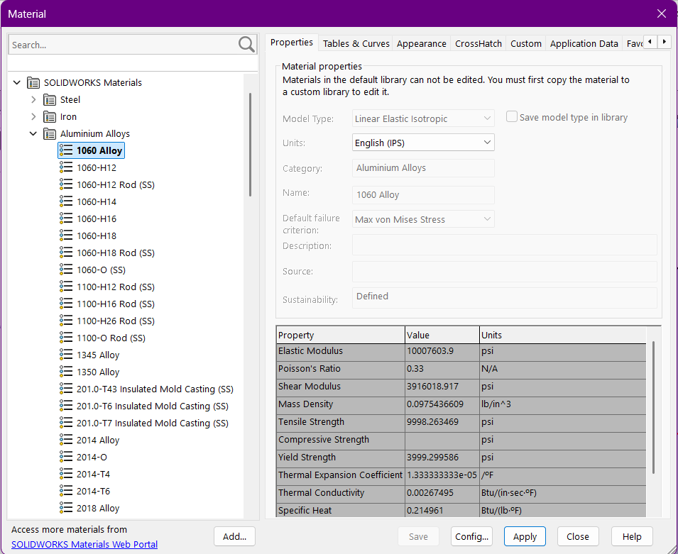
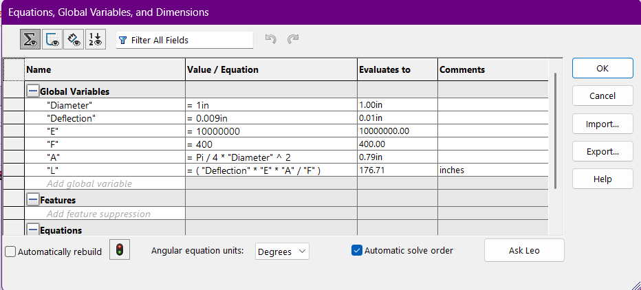
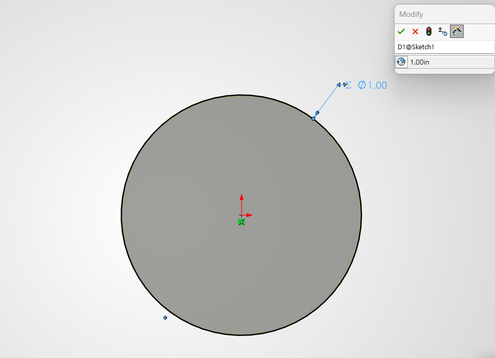
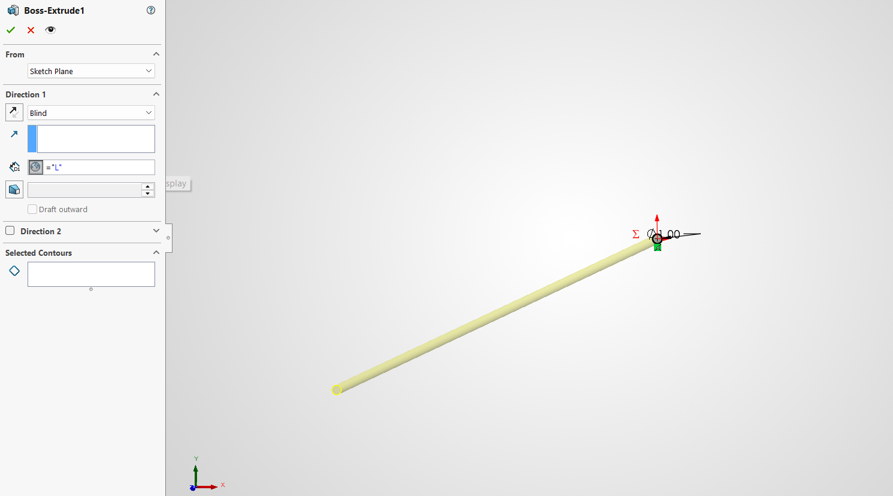
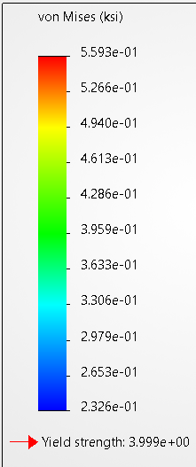
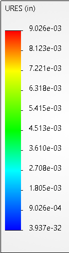

# A3 – Parametric and FEA

## Objective
The goal for this assignment was to use parametric design to deign an aluminum bar by assigning dimensions to their appropriate parameters. We also needed to use Finite Element Analysis(FEA) to examine trends like maximum stress within the bar.

## Analyze
The first thing I did for this assignment was I took time to read and note all of the values I would need. I utilized the elongation equation, so I needed to determined what I knew and what I needed to know. The maximum elongation was given to me at 0.009 inches. I was given rages for force between 300-500 lbf, and I was given a range for Young's Modulus between (8.5-11.5)E6 psi. Per the assignment I was free to decide the value of the cross sectional area and the force within the given range. Young's Modulus was determined by the material which had to be aluminum. 

(Figure 1)

As seen in figure 1 the geometry is a simple bar, fixed on one side, with a force pulling the bar axially.

## Decide
After taking all of my constraints into account I decided on all the values I preferred. I began with the area, but rather than deciding on an area outright I started with the diameter. I chose 1 inch for the diameter value because I felt it would make all my math nice and simple, and not cause the bar to be too long. I chose my force to be right in the middle of the range at 400 lbf. To choose the Young's Modulus value I first picked an aluminum alloy that had a value within the range. As seen in figure 2, I chose the 1060 alloy with a Young's Modulus value of 10E6 psi

(Figure 2)

## Communicate

### Parametric Design of the Bar
After deciding on all my values it was finally time for me to start making this bar. For this project I decided to use the software SolidWorks because it was the one the professor used in class and also the most recommended for the course. This was my first time using this software, so I used the provided videos under the assignment to guide my way through parametric design and FEA using SolidWorks.

#### Step One
Before I began sketching anything, I first went through and assigned all of my global variables to be used on the part.

(Figure 3)

As seen in figure 3, I started by noting my diameter, maximum deflection, Young's Modulus, and force value. I then used my chosen diameter to find the area using the circles area equation. Once I had all of the values I needed as stored global variables, I then used the elongation equation and solved for L. This ended up as L=(deflection*E*A)/F. The variable L was used to parametrically determine the length of the bar later in the design process.

#### Step Two
The next step was to begin my design process, which started with a simple sketch of the circle at the origin of the axis. I then assigned the value of the diameter to fluctuate to what ever my global diameter value was. 

(Figure 3)

After finalizing the sketch I then extruded it. I set the length of the extrusion to be equal to the parametrically determined length value. This is so if I were to change any known variables, then the length of the bar would automatically adjust with those changes to the parameters.

(Figure 4)

### Finite Element Analysis of the Bar
After designing the bar in CAD I had to conduct an FEA of the bar with the same load used to determine its geometry. 
#### Step One
Before I ran the simulation to find a deflection map and stress map, I needed to apply the force to one side of the bar and fix the other side to a "wall". After setting those points, I created a mesh over the bar for a static analysis to begin.
#### Step Two
The last step was to click run to generate a deflection map and a von Mises Stress map.

##### von Mises Stress map:

(Figure 5)

As seen in figure 5, the maximum stress was 0.5593 ksi which is lower than the actual yield strength of aluminum at 40 ksi. By dividing the yield stress by the maximum stress, I determined the Safety factor to be about 71.52.
##### deflection map:

(Figure 6)

### Design Reflection
The axial deflection calculated was .009 inches and the FEA value was .009026 inches, which gave me a very accurate result with a percent difference of 0.29%. I believe these are so close due to the simplicity of the shape and load applied. The geometry makes it really simple and difficult to get anything far off from the calculated values. Regardless of the small difference I would trust the FEA computed results because there is always room for human error in hand-calculations, and if the shape or load weren't very simple the percent difference might have been way more.

If there were a substantial pin hole on the bar its stress concentration factor will generally be around 3. Using my nominal stress value of 0.5593 ksi and multiplying it by the stress concentration factor, I estimate the peak stress to be about 1.68 ksi. This value is below the yield strength of aluminum and gives me a safety factor of 23.81. Therefore, the bar would still satisfy the safety factor.
### Lessons Learned
Throughout this assignment the biggest thing I learned was how to actually use SolidWorks. I was able to parametrically design and complete Finite Element Analysis using SolidWorks, which I have never used before. This led to mistakes where I would edit things and forget to save them, so then i would have to redo it all over again. This assignment took me around 5 hours to complete. 

### Modify Design Parameters
This part had me cycle through my parameters, change them, and then see how it would affect the length of my bar. For the variables deflection and area I came to the conclusion that they would proportionally affect the length of my bar. Which means if I increased any of those values, then the length of the bar would also increase. I went through and increased the variables one by one and when changing the values around that is exactly what happened. For the load I thought that it would inversely affect the length of the bar. I increased the load variable in CAD and the bar decreased in size, which confirmed my original thoughts.
