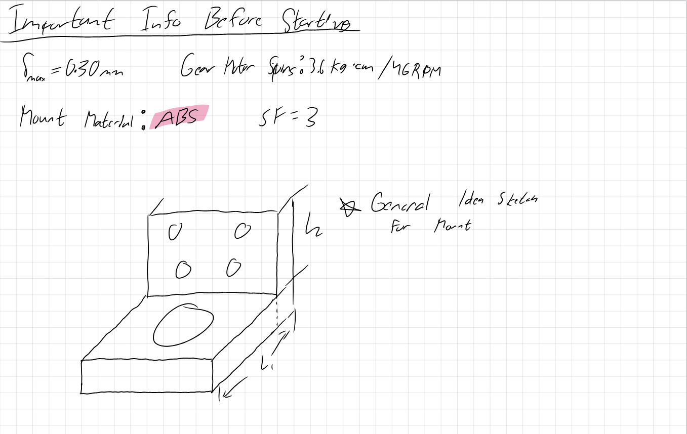
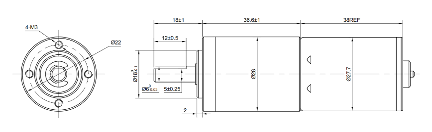
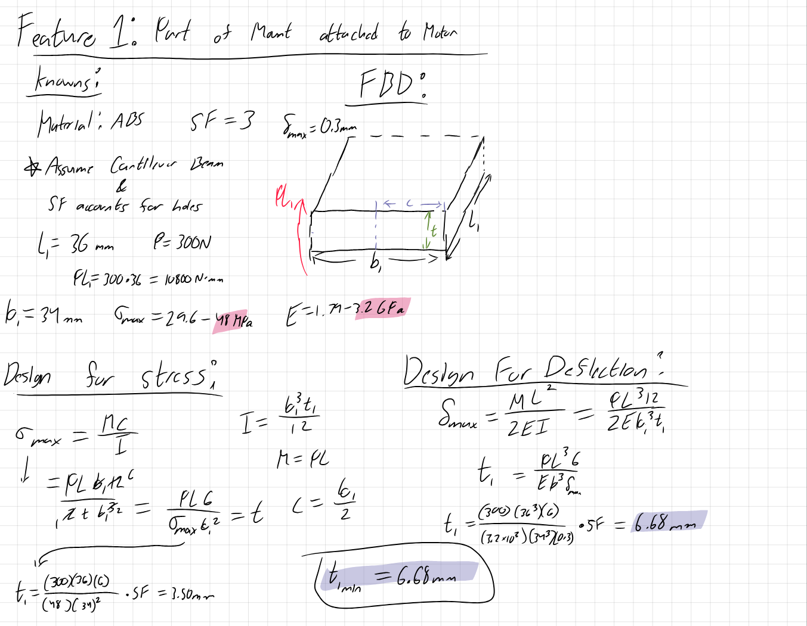
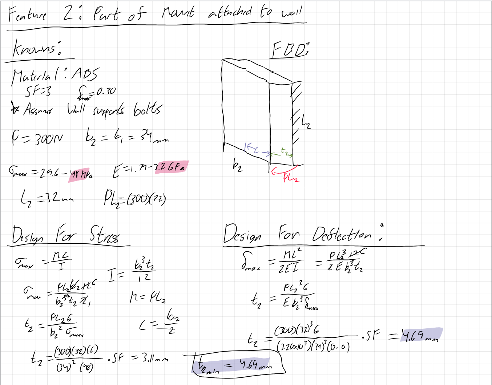
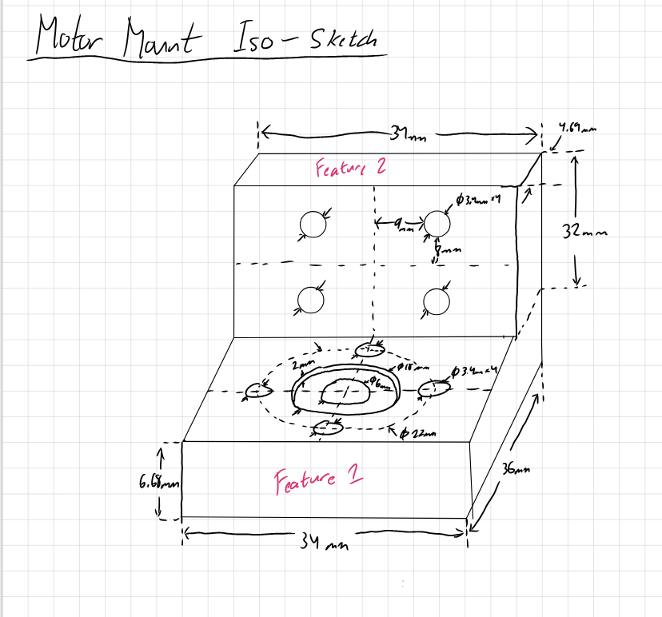
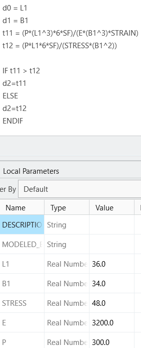
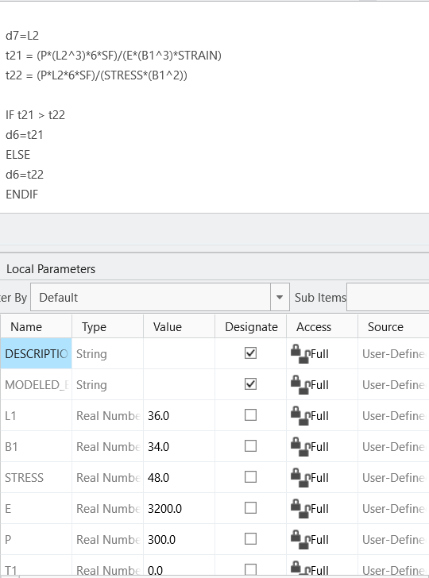
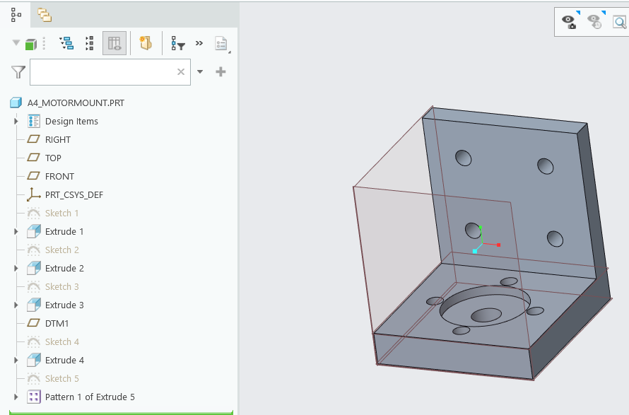
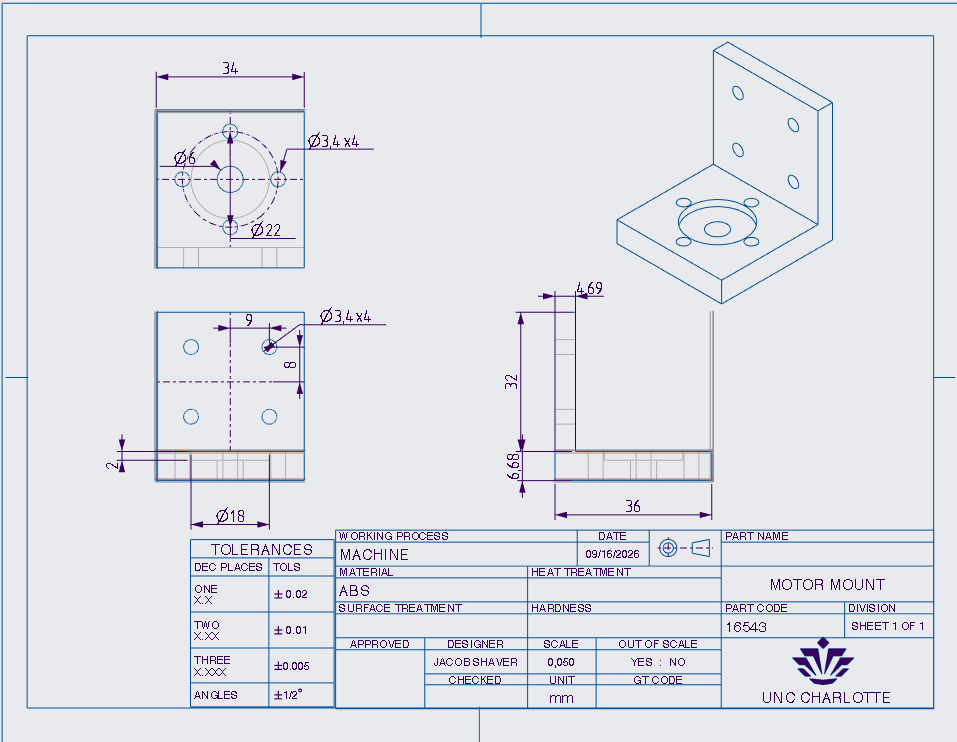

# A4 – Motor Mount

## Objective
For this assignment I was told to design a mount for a designated motor. In order to design the motor mount I had to design for deflection and for stress to find the minimum thickness of each feature.

## Analyze
Before I started I took in all the aspects of the design that I knew and needed to account for. I needed to design an L shaped mount in which one side attached to the wall and the motor attached to the other leg. I knew a force of 300 acted on the mount, and both legs had a max deflection of 0.30mm. The Length dimensions were up to me, and I needed to design to find the minimum thickness of each leg. The whole design had a safety factor of 3. Lastly, I needed to decide on the material which included ABS, PETG, and PLA.

## Decide
After Taking all of the assignment info in, I began brainstorming for what my dimensions might need to be. 

(Figure 1)

This is when I made a very general sketch of what I wanted the motor mount to look like. As seen in figure 1 I decided to make the length of feature one to include the intersection of the two legs, while feature two had a length separated from the intersection. I decided to choose these values after I had a final model of the equations I was using to minimize the thickness. When I was deciding on the values for my lengths, I took the dimensions of the motor mount as seen in figure 2 into account to properly fit the motor onto feature 1. I also chose to use ABS as my material for the motor mount.

(Figure 2)

## Communicate
### Feature 1 

(Firgure 3)

Feature 1 was the leg that is to be attached to the motor. To start off my design of feature 1, I listed all of my known variables. The results in figure 3 show the final values for each variable; however I did not decide on my length values until I saw how they would affect the thickness equations when accounting for stress and deflection. I used an online chart to determine the maximum stress and the Young's Modulus value. I then drew out my free body diagram to show what was happening to the leg. After all of the setup, I began setting up my equations for stress and deflection and then rearranged the equations as variables in order to solve for thickness. After looking at both of my equations solved symbolically I decided to make the length 36mm and the base length 34mm. The equation that accounted for deflection had a higher minimum thickness, which made that my final value for the design.

### Feature 2 

(Figure 4)

Next I needed to find feature 2's thickness, which is the leg that will be attached to the wall. For this Feature I had all of the same values except for the length of the bar. I made a new free body diagram for this feature and then began modeling my equations. I modeled the equations in the same manner as feature 1; however, once I got to the final equations I then estimated what I needed the length to be. I assigned length to be 32mm and solved each equation for thickness. Just like feature 1, the deflection equation ended up having the higher value for thickness, which told me that it had to be my final thickness for feature 2.

### Isometric Drawing
After finalizing all of my values for the design I made a detailed isometric sketch for the final Motor Mount. This can be seen below in figure 5.

(Figure 5)

### 3D CAD Parametric Model

To start off my design I made a sketch for Feature 1 at 36mmx34mm and then extruded that rectangle up to the thickness found earlier. In order to make feature 2, I started a sketch at the edge of the surface on feature 1. The sketch I made was a rectangle that had the same base length as feature 1 and the thickness found earlier for feature 2. I then extruded this sketch to the designated 32mm.

Before I made the feature for the mount to attach to the motor and wall, I first needed to set up this design parametrically. As seen in the two figures below I assigned my variable as global parameters, and then set up else if statements. Each statement assigned the two limiting equations from my calculations to a variable, compared the two, and set the thickness to be which ever equation got the higher value. Each relation was set to automatically change the thickness whenever I shifted the known variables around. This would enable me to change values in CAD and make automatic adjustments rather than going through and recalculating each value by hand.

(Figure 6 & 7)

Once the parametric design was set up I added the features to fix the mount to the wall and the motor. This included 4 equal diameter holes to attach the mount to the wall, and a divot with bolt holes to allow the motor to slot in and attach to the motor mount. This information was given to me by the professor, where the holes needed a 3.4mm clearance and the motor dimensions were given to me by the sketch in figure 2.

Below is how my final design came out. 

(Figure 8)

### CAD Drawing
After finishing my design I was tasked with creating a multiview drawing with a isometric, top, front, and side view. I applied ASME standard conventions for the drawing. Below in Figure 9 is my final drawing. 

(Figure 8)

### References 
https://www.specialchem.com/plastics/guide/acrylonitrile-butadiene-styrene-abs-plastic

https://www.omc-stepperonline.com/brushed-24v-dc-gear-motor-3-6kg-cm-46rpm-w-99-5-1-planetary-gearbox-pa28-28245800-g100
### Important Files
[Zip file for Multiview Drawing and 3D Model](uncc_asize.frm.zip)
