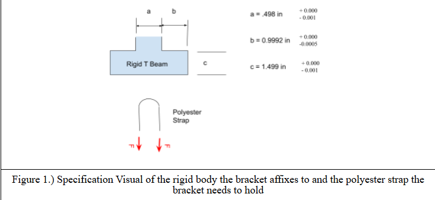
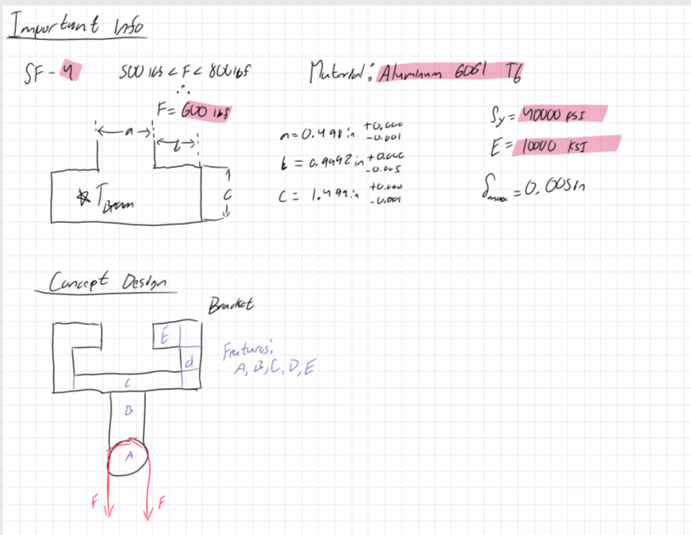
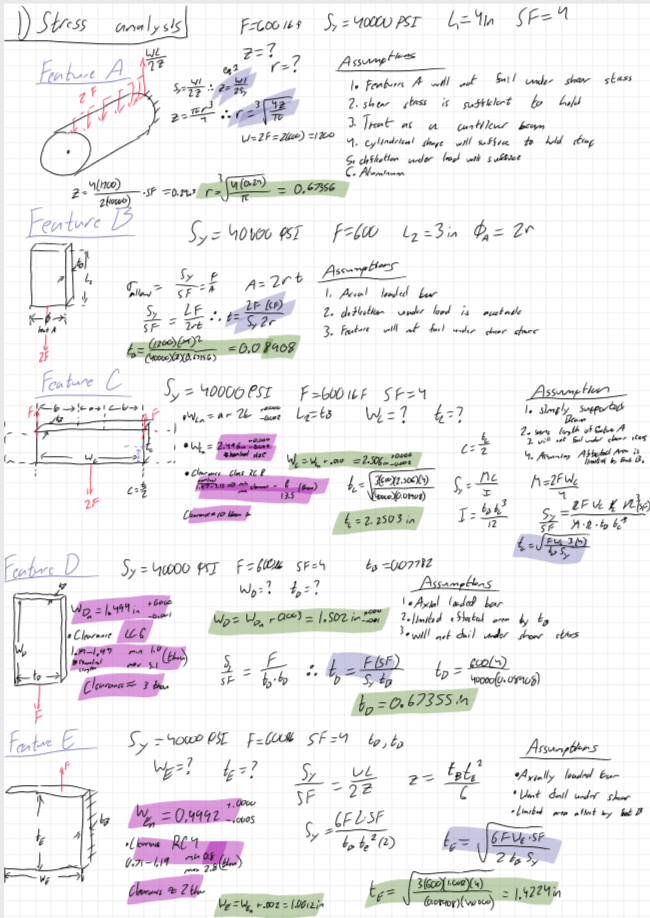
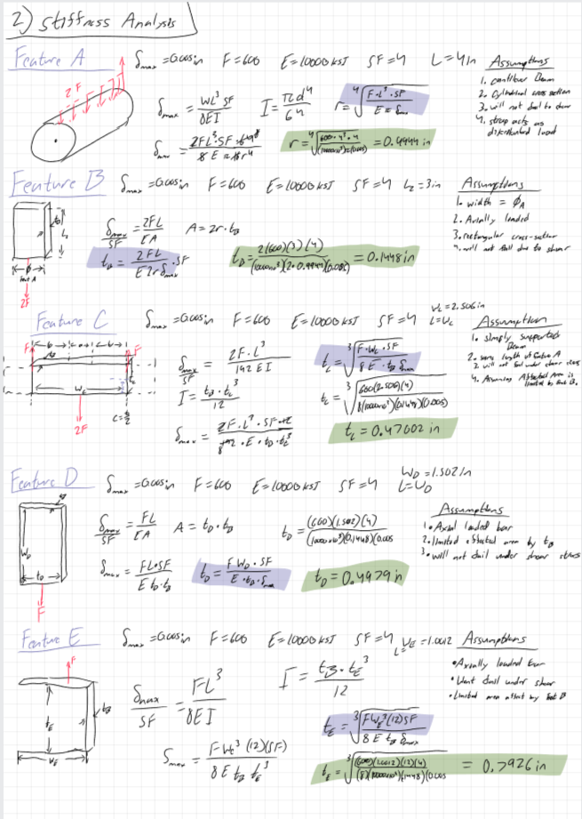
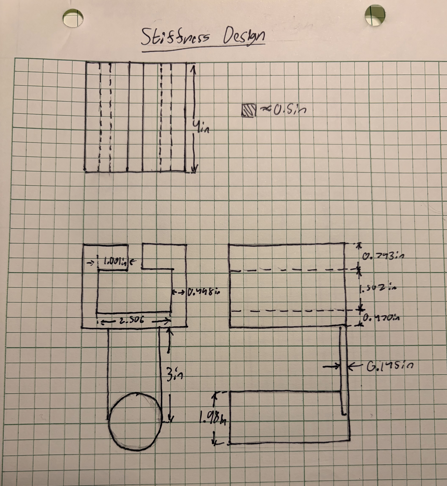
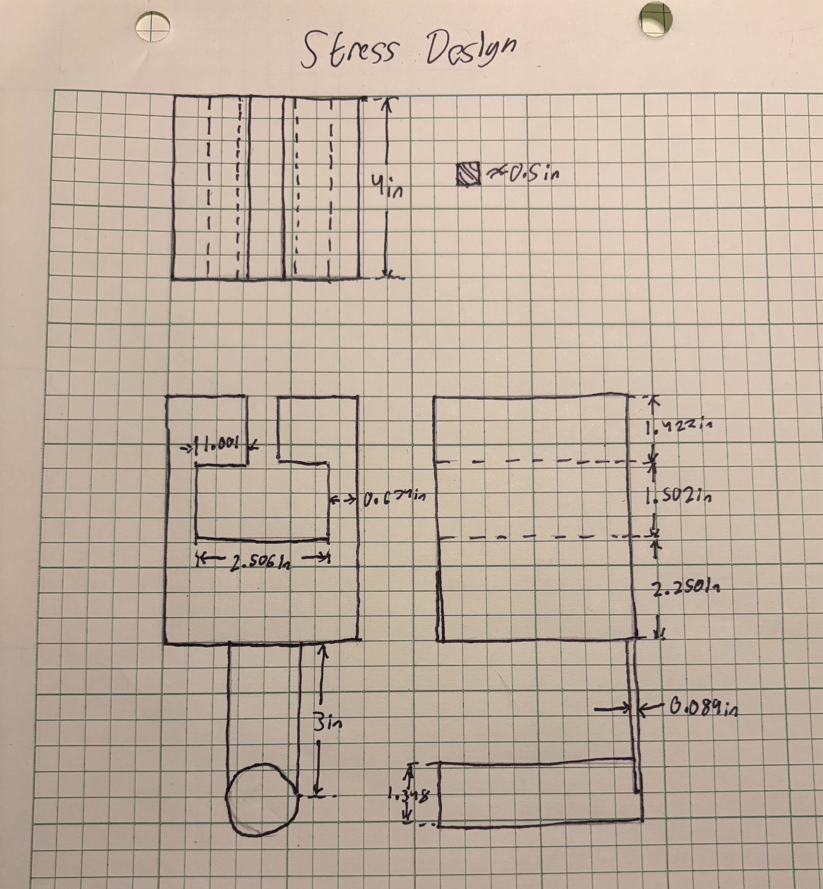
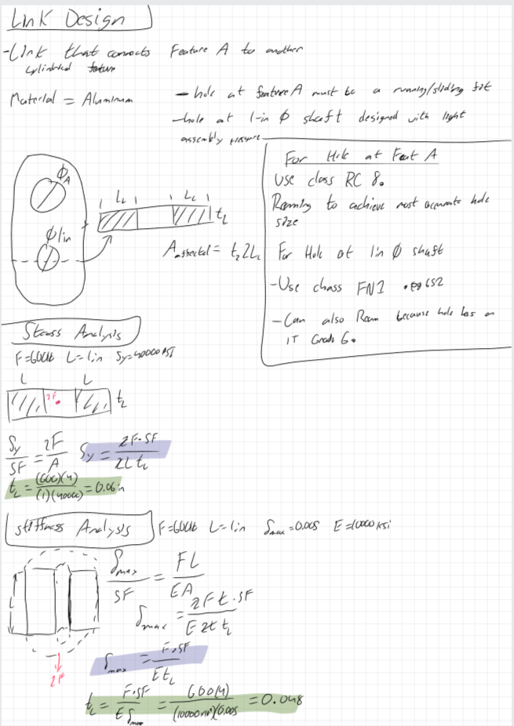
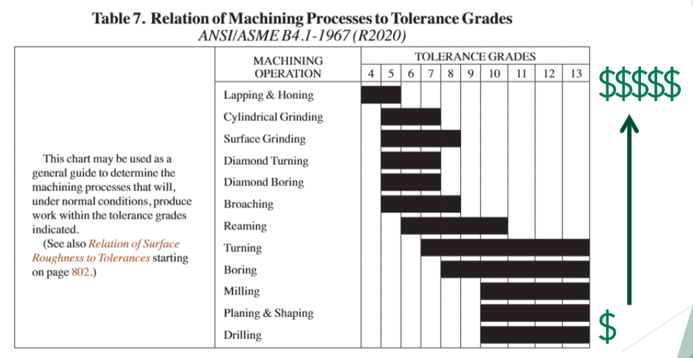

# A5 – Bracket Design

## Objective

(Figure 1)

The objective for this assignment was to design the dimensions for a bracket using two analysis types. These were an analysis for stress throughout the bracket and an analysis for the the stiffness of the bracket. The bracket is meant to slide smoothly over a T bar and needs to hold a strap that applies two pulling forces downward on the bracket.
## Analyze

(Figure 2)

Before I started any math, I first drew out what I needed to make and what variables I needed to account for. I knew I was finding the dimensions for segments A-E. 

**For my knowns:**
- The force needs to be between 500-800 lbf
- The safety factor is 4
- Max deflection is 0.005 in
- I need to choose 1 of three materials, aluminum 6061 T6, Steel (ASTM A36), or Titanium (Ti-6Al-V4)
- And I knew the fit discriptions for all givin dimensions:
  - “a” intention for use where accuracy is not essential
  - “b” is about the closest fits that can be expected to run freely
  - “c” is where accurate location and minimum play is desired

## Decide
I chose to use Aluminum 6160 T6 as my material, and I used _MatWeb_ to find the average values for aluminum's modulus of elasticity and yield strength value. I chose to use 600 lbf simply because it was nice rounded force somewhat in the middle of the range. Lastly, I used assignment resources to segment the bracket into easy to understand segments for later use as seen in the concept design in figure 2. 

## Communicate

### Design for stress
After I determined what my known variables were, and determined what order I needed to solve the segments I began an analysis using the yield strength of my material. The last variable I chose to keep consistent, was that the length of the bracket what 4 in. 

For figure 3, Pink highlights values found by using the machinery handbooks guide on different fits starting on page 641, blue highlights symbolic solutions for values, and green highlights final values to be used.

(Figure 3)

The main factor that allowed me to solve the various dimensions for the bracket was the assumptions that I made. The first assumption was that the bracket would not fail due to shear stress. At feature A I assumed that it functioned like a cantilever beam with a distributed load over the top of it, which is the same assumption I made for feature E as well. That paved way for me to solve the radius of feature A. After finding the radius of A I made the assumption that B's width was equal to the diameter of A, that the height of B was 3 in, and that B extended from the top half of A's circular face to the base of the bracket. I treated B as a bar floating in space with an axial load, which is the same assumption I made for feature D. For feature C I assumed it was a simply supported beam. For segments C-E I made the assumption that the affected area was limited to the thickness of B. 

The other main problem was a selection for proper clearances at each length a, b, and c. To do this I examined my fit descriptions and decided that feature C needed the classification RC 8, feature D needed LC 6, and feature E needed RC 4. Given my starting lengths at a, b , and c, I found a min and max range of clearance that could be used and chose values that landed generally in the middle of the range. This was so that my T-bar would fit even if the size was a little off from the values I was given for the problem. 

### Design for Stiffness
After Completing my analysis for strain I moved on to solve for the same values but using a given max deflection and modulus of elasticity. I made the same assumptions I did for stress analysis, and used the same pre-calculation values like length of segment A or B. Nothing changed with my width values that I found using the book and the various fit descriptions, so I used the same values in my stiffness analysis. 

For figure 4, blue highlights symbolic solutions for values, and green highlights final values to be used.

(Figure 4)

### Multiview drawings for both Stress and Stiffness Analysis
These sketches were done on engineering paper where one grid square was seen as 1/2 in.

(Figure 5)

(Figure 6)

### Lessons learned
#### Governing Failure Mode
One feature that had a large disparity between Stress and stiffness analysis was Feature A. For this feature, stiffness governed the diameter by about .320 in, where stress had .674 in and stiffness had .994 in. The difference wasn't very close, which seemed to be true for a lot of the features. Whether stiffness or stress governed the value found, the disparity between the values tended to have a gap of .100 in at the very least and 1.75 at the greatest.
#### Error Propagation
With the way I set up my design process, the thickness of feature B transferred through all of my features C-E. At one point I got down to feature D and realized something wasn't right when my values started to feel kind of wonky and unbalanced. After realizing that, I started again from the top and followed my work down plugging back in values and checking my formulas. This is where I realized that I miss inputted in my calculator and got an incorrect value for thickness of feature B. This was the mishap that cause a downward spiral, and after fixing it my numbers came out much better and more balanced. 
#### Assumption Sensitvity
One Assumption I made was that the material was Aluminum 6160 T6. If that were a different assumption then my values of modulus of elasticity and yield stress would completely change. This change would swap the values at each feature for both analysis, because for stress the yield stress is present in each features formula and for stiffness the modulus is present in each features formula. 

### Link design
After designing my bracket I was tasked with designing a linkage that linked Feature A to i 1 in diameter shaft. I was told to assume that the linkage needed to support the same amount of force as the bracket, and that each analysis was to be based on the smallest cross sectional area at the holes. I also assumed that the length from the holes to the sides of the link were equal to the length on all sides of the length. 

After making all those assumptions I needed to design the linkages dimensions using stress and then stiffness equations, as seen in Figure 7. Between the two analysis my stress analysis ended up with high values, making that my governing dimensions for the link.

(Figure 7)

#### Hole Fits
The last part of this assignment was to determine the proper fits of the linkage holes. Per the assignment I was given that the hole at Feature A needed a running/sliding fit, and the hole at the shaft needed to be designed with light assembly pressure. For this I utilized the Machinery Handbook 32nd Edition, and any page numbers listed relate to this book.

##### Hole at Feature A
Starting with this hole I took into account that I needed a running/sliding fit and knew that the RC class was that fit type. I figured that in order to reduce the cost you would want a less precise method of RC or a looser fit, so I chose to use RC 8 from the table on page 655. After Classifying the fit type RC 8, I used Table 6 on page 674 to find the IT grade. After finding my IT grade I determined that Reaming would be the best in the middle option for the IT grade Using the table in Figure 8.
##### Hole at Shaft
After finding the hole at Feature A I needed to find the fit type for the hole at the 1 in diameter shaft. The description for this hole said it must be designed using light assembly pressure. On page 652 I found that the best classification was FN 1 because it is a light drive fit that requires light assembly pressure. Following the steps from the first hole I used the chart on page 661 to find what my standard limits were. I went from there, back to Table 6 page 674 to determine the IT value for the process. Using the table in figure 8, The IT led me to choose the reaming process because the IT value landed in that procedure and it was the best middle ground for precision to price. 

