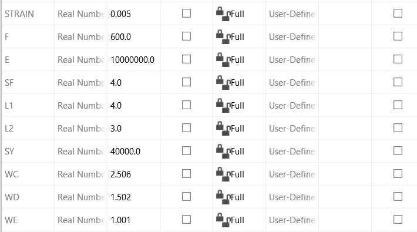
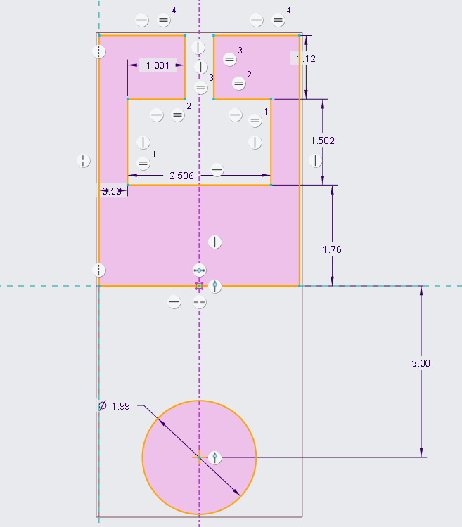
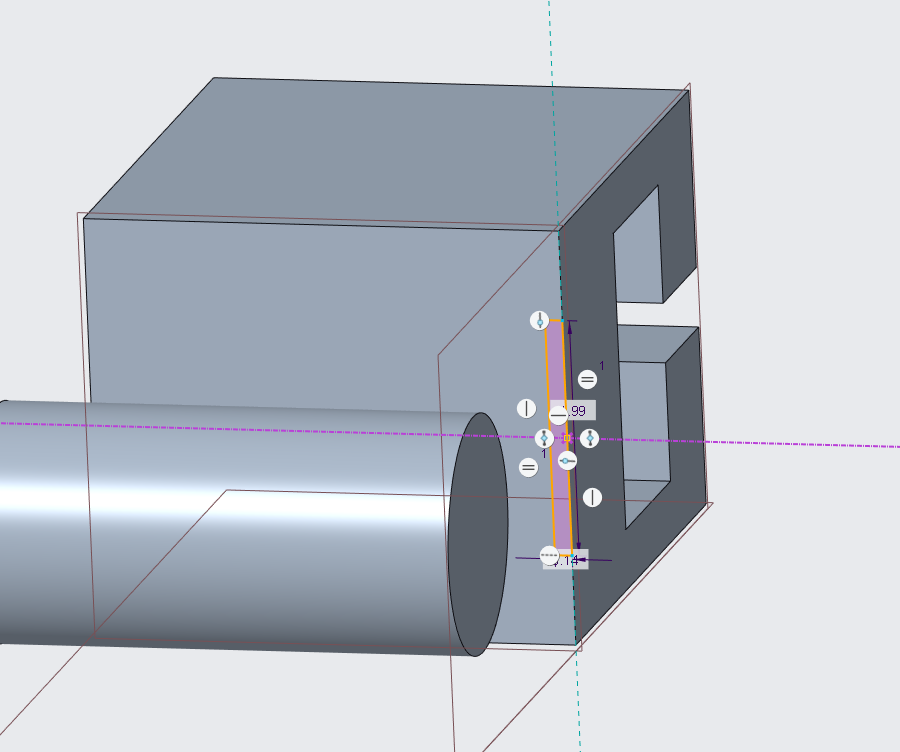
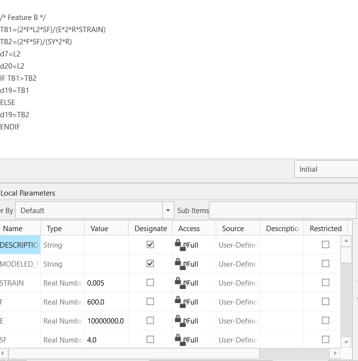
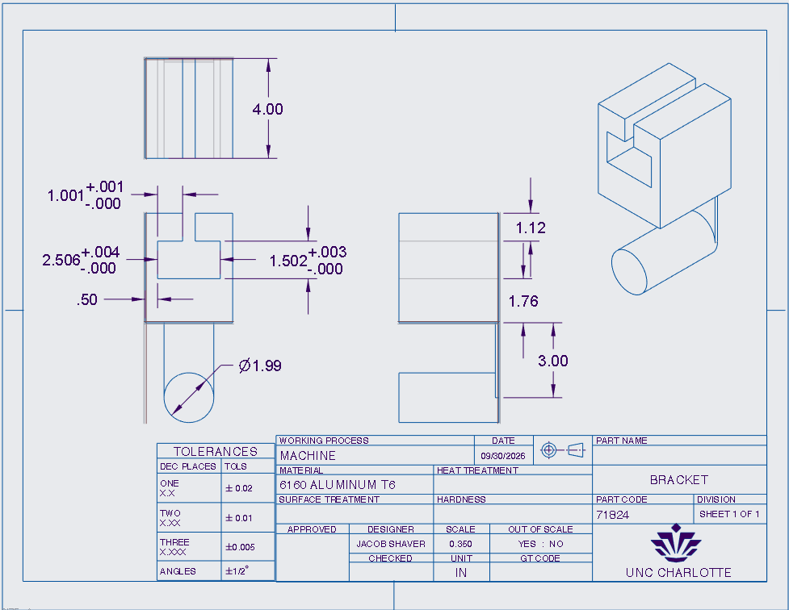
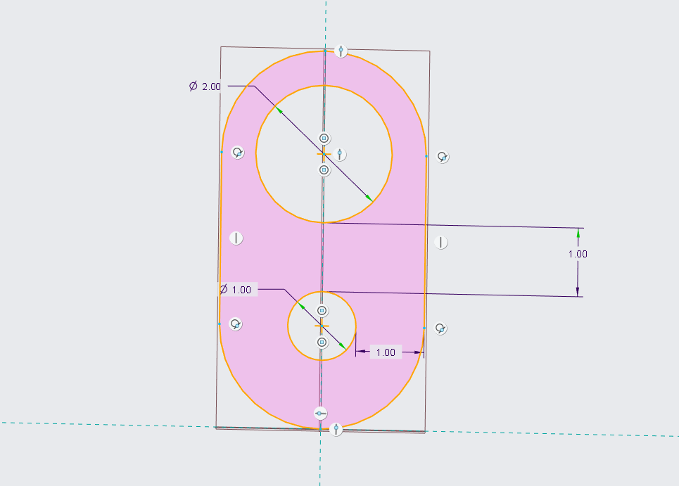
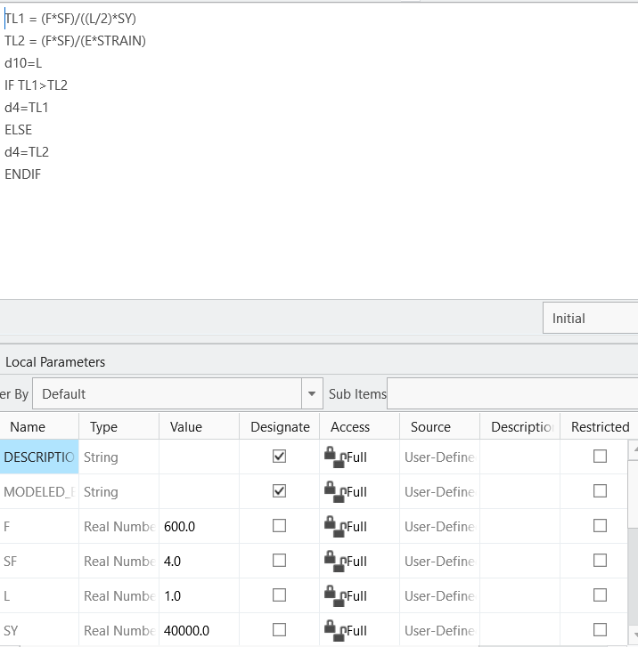
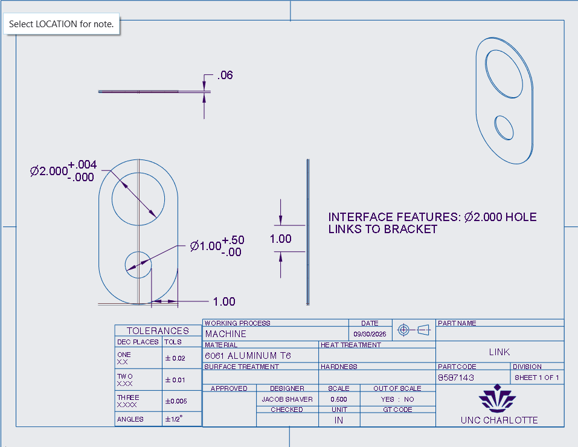

# A6 – [Topic]

## Objective
For this assignment I needed to parametrically design a solid model and a Multiview drawing that represents my final bracket design from A5. 

## Analyze
Before Starting the modeling process I first looked at the assignment and found what it wanted, which was a fully parametrically designed bracket with either stress or strain deciding the value. I also needed to generate drawings for the bracket that had accurate depictions for all dimensions and tolerances. 

## Decide
In order to start the process I went through the all of the work I did on A5 and decided for each feature, whether the stress analysis had the higher values or the deflection analysis did. Features E, D, and C all depended on the stress analysis because it gave the higher values needed under the max stress. Features A and B both depended on the deflection analysis because it gave the biggest values while under a max deflection of .005 in.

Before I started the CAD process, I went into CREO's relations section and set up the following values in figure 1. These are the values I used to parametrically design the bracket, and they were all obtained in the previous assignment A5.

(Figure 1)

## Communicate
### Design for the Bracket
#### Parametric Design
The first thing I did was come up with a sketch of the bracket's Features A-E, excluding B, from the front with values that were very close to those found during the stress and deflection analysis. This can be seen in figure 2.

(Figure 2)

After making the general sketch I extruded it to the desired length that I came up with in A5. I then made a sketch on the underside of my bracket that matched the general dimensions of feature B and extruded it down to connect The bracket to Feature A. This can be seen in Figure 3.

(Figure 3)

Using the Values I set up in figure 1 I made a relation in Creo for Features A through E. All of them were set up similar to the example for Feature B, seen in figure 4. In this example I set up both equations that I used to find the thickness of B and then compared them. If the value was bigger for the stress analysis, then the corresponding dimension was set to auto update to that value, which is true the other way around. This is the same exact process I used for each feature, and all the equations were gathered from the blue highlights in my work for A5.

(Figure 4)

#### Drawing
After making my model I was ready to start making my Multiview drawing of the Bracket. The specifics for the drawing included the drawing needed to be in third angle projection(symbol not required but recommended), the tolerances for the hole in the middle of the bracket needed to be included, and a tolerance block needed to be included for any non specified dimensions. I decided that the projection view symbol was important to include, and my drawing included each of the other requirements as seen below.

(Figure 5)

#### Reflection
One lesson that this assignment taught me is the difference between third angle projection and first angle projection, and how important it is to know the difference between them/know which one you plan on using for you drawing as to not cause confusion. I spent about 5 hours total on this assignment. 

The main equation that drove the thickness of feature B was the equation for stiffness. In CREO I used the relations tab to set up equations for B. I used both the stress and the strain equation separately incase I wanted to change any of the global variables at a given time, like if force on Feature A shifted to a smaller or bigger value. Both equations depended on global variables that I knew I would have to manually change like force or young's modulus. After making those equations the relations was set to compare and automatically set the thickness of the feature to the greater value. I did the same for each other feature, so that if the calculations changed, then the dimensions would automatically adjust to the new values with whichever analysis was greater. 

One dimension that had a higher tolerance was the width of Feature D, which wanted a close fit and accurate location. One Dimension that I used more relaxed tolerances on was the length of the bracket, which had a tolerance of plus or minus to thou. The width of D was a functional surface and needed to be highly accurate to get the correct fit I wanted. The length of the bracket was a non-critical so it didn't matter too much, which gave it the much more relaxed tolerance. If the entire design had been held to extreme tolerances, then the actual making of the bracket would take way too much time to make, and would cost more because you would need to use high quality equipment for every single dimension.  

### Design for the Link
#### Parametric Design 
For the link I used the same exact global variables as I did for the bracket. I made the general link shape first as seen below. For the holes I used my notes from A5 and the machinery's handbook(ed 32) charts of fits, on page 655 & 659 to find the maximum value for the hole diameters and their tolerances. I based the links walls to be spaced from the edge of the bottom hole. All the values I used can be found in A5.

(Figure 6)

After making the sketch I extrued the link and set up the value for its thickness in CREO's relations tab. I did this the same way as the Bracket, which can be seen below. 

(Figure 7)

#### Drawing 
After making the 3D design I made the Multiview sketch of my link. The requirements for this drawing are as follows; has to have complete dimensioning and tolerancing, third angle projection, include a tolerance block for non-specific dimensions, at least two callouts for different tolerances applied to critical features, and a note identifying the interface features between the link and bracket. The sketch came out as shown below.

(Figure 8)

#### Reflection

One lesson I learned about part to part compatibility through tolerancing is, that the tolerancing depends on what kind of fit you are looking for. If I wanted the hole of the link to press overtop Feature A of the bracket, then I would have chosen to make the hole tighter and for the tolerances to be less forgiving. It is important to know what goal you want to achieve before you decide on what kind of leeway you want to allow for tolerances.

I learned that dimensioning and tolerancing do much more than just presenting the size of a part. The show what intentions I have for that specific section of the design, like if the tolerances are tighter the section would be more critical to the design functionality. Which would also show that the dimension needs to be manufactured with more care. However, if the tolerances are more forgiving then it is less important for that dimension to be extremely accurate. 

### CAD Files for Bracket and Link
[Bracket Zip File](a5_bracket.zip)

[Link Zip File](a5_link.zip)

